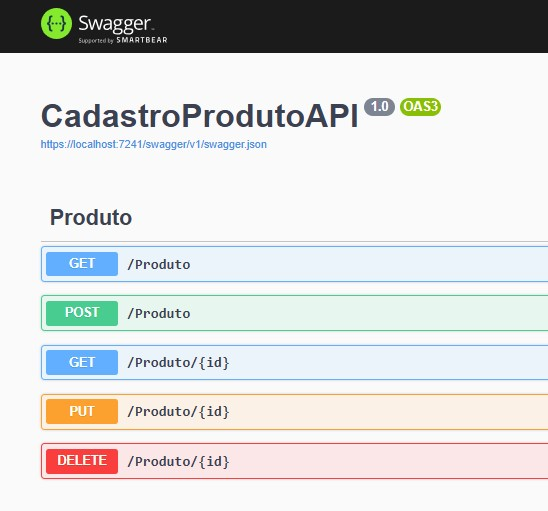
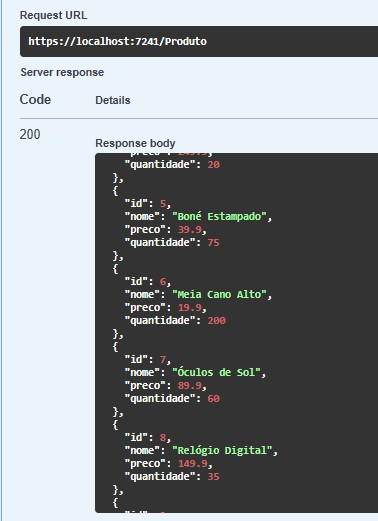
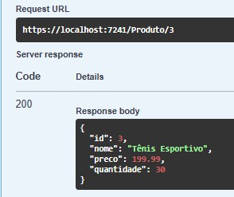
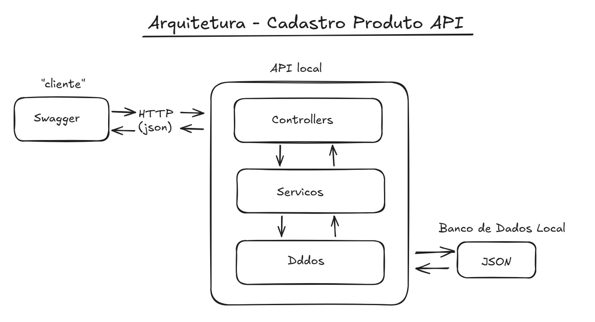

## CadastroProdutoAPI

Essa é uma API RESTful em c#  para gestão de produtos com arquitetura em camadas e com persistência em JSON.
---
# Imagens
1. Tela inicial de execução no Swagger:
- 
2. Tela da resposta de uma busca pelos produtos cadastrados:
- 
3. Tela da resposta de uma busca de um produto pelo seu ID:
- 
4. Tela de resposta do tratamento de busca com ID inexistente:
- 
6. Diagrama de arquitetura do projeto: Cliente → Controllers → Servicos → Dados → JSON
- 
---
## Tecnologias Utilizadas

**C#**
**ASP.NET Core**
**Controllers**
**Swagger**
**Persistencia em JSON**

## Funcionalidades

**GET /produto**
Retorna todos os produtos cadastrados

**GET /produto/{id}**
Retorna o produto pelo ID

**POST /produto**
Cadastra um novo produto

**PUT /produto/{id}**
Atualiza um produto existente

**DELETE /produto/{id}**
Deleta um produto

## Estrutura do Projeto

CadastroProdutoAPI

	Controllers
		ProdutoController.cs

	Modelos
		ProdutoAPI

	Servicos
		ProdutoServicoAPI.cs

	Dados
		OperacaoBancoDados.cs

	Program

## Como executar

1. Clone o repositorio:
https://github.com/TonyBranquinho/CadastroProdutoAPI

2. Navegue até a pasta do projeto:
CadastroProdutoAPI

3. Execute o projeto:
dotnet run

4. Acesse o Swagger:
https://localhost:7241/swagger/index.html (acho que so vai funcionar no meu pc)

## Conceitos Utilizados

- API REST: Interface que permite comunicaçao entre aplicações por meio de requisiçoes HTTP padronizadas.
- Controllers: Classes responsáveis por gerenciar as rotas (endpoints) e receber as requisiçoes.
- Endpoints: Cada rota criada que responde a um verbo HTTP (GET, POST, PUT, DELETE).
- SWAGGER: Ferramenta de documentaçao e testes de APIs.
- Persistencia em JSON: Os dados sao salvos em um arquivo .json local, sumulando um banco de dados simples.

## Melhorias Futuras

- Adicionar validaçao de entrada mais robusta.
- Implementar autenticaçao e autorizaçao.
- Integrar com banco de dados relacional (ex: SQL Server).
- Criar testes automatizados.

## Autor
**Tony Branquinho**
linkedInd: [jeferson-branquinho](https://www.linkedin.com/in/jeferson-branquinho/)
GitHub: [TonyBranquinho](https://github.com/TonyBranquinho)
